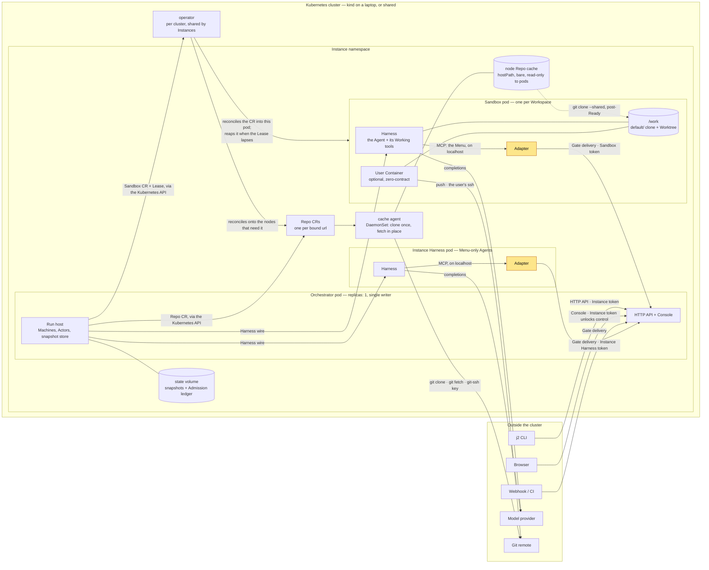
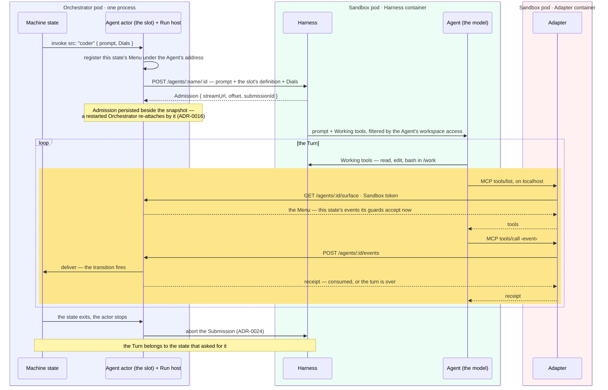
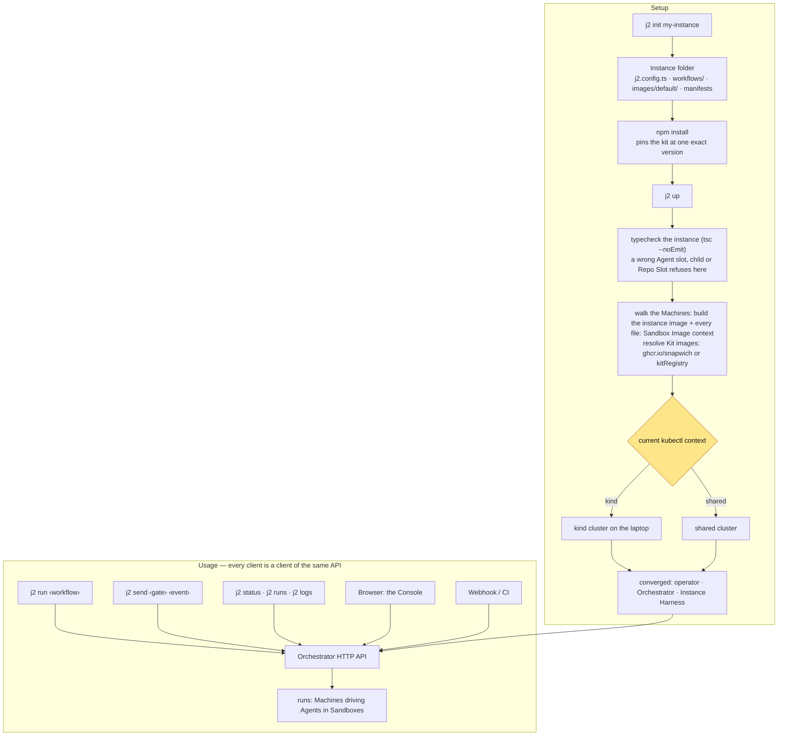
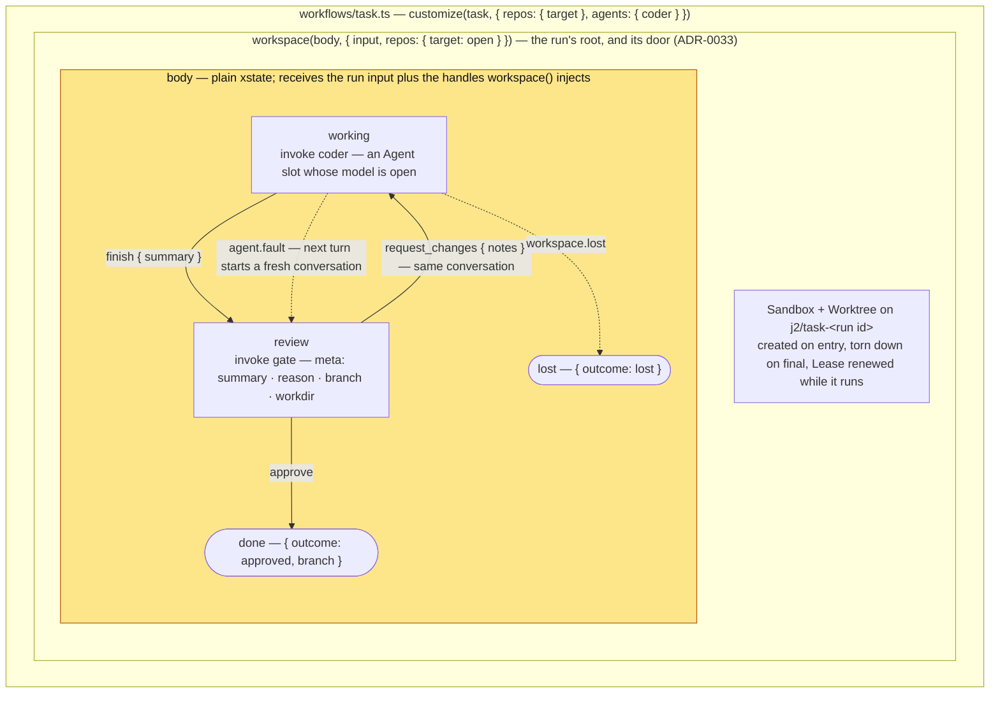

# j2 architecture

Four pictures of j2, each answering one question, each drawn in the terms [CONTEXT.md](../CONTEXT.md) defines. The
decisions behind the shapes are in [docs/adr/](./adr/); this page cites them but does not restate them.

## The problems

j2 exists to solve these. Each diagram below ends with an **Answers** list that points back here.

1. **Non-determinism.** A workflow is a Machine: readable before it runs, drawn by the Console while it runs. You review
   how the work happens, not only what comes out.
2. **Isolation.** A filesystem sandbox is not enough. Each Agent runs in its own Sandbox pod with its own network,
   process space, and Worktree. Code execution and the control-plane credential live in separate containers. A lapsed
   Lease lets the operator reap what an Agent left behind.
3. **Distribution.** Compute is remote. The Orchestrator holds only the Actor; the Harness runs wherever the cluster
   schedules it.
4. **Composition.** Infra pieces and agentic pieces are xstate: Workspace, Pool, Source, and Gate wrap or feed a body
   that stays ignorant of them, and each state frames one Agent's Turn. A Workflow nests another as an actor.
5. **Model agnostic.** One Harness, j2's own, hosts any provider. An Agent is a model plus instructions, and a Turn may
   set Dials.
6. **Headless.** The Orchestrator is an HTTP API. The CLI, the Console, and webhooks are clients of it.
7. **Local to shared.** The same Instance folder converges into a kind cluster on a laptop or a shared cluster. Only the
   kubectl context changes.

## 1. What runs where

A running Instance. Every arrow carries a named protocol or credential; edges that are converge mechanics (Secrets,
ConfigMaps, Services, image pulls) are left out and belong to diagram 3. The highlighted boxes are the only containers
that hold a credential for the Orchestrator.

The Agent's only control-plane peer is the Adapter on the pod's loopback (ADR-0013). The Harness container gets the
Adapter's URL and nothing else: no Orchestrator URL, no token. So the container that executes code cannot reach the
control plane, and the container that can reach it executes nothing. The Instance token, which unlocks control in the
CLI and Console, never enters any pod (ADR-0032). Nothing in the cluster represents a run; a Workspace's liveness is a
Lease the Actor renews, and the operator reaps a Sandbox whose Lease lapsed (ADR-0001, ADR-0021). The Instance Harness
is the same two containers without a Worktree, and hosts every Menu-only Agent's Turn (ADR-0031).

**Answers**

- **Isolation** — the Sandbox pod: its own network and process space, `/work` shared only inside the pod; the Adapter
  and Harness split; the operator's reap on a lapsed Lease.
- **Distribution** — the Run host holds Actors and the ledger; the Harness wire is the only thing between an Actor and
  its Agent, so the Sandbox lands on any node.
- **Model agnostic** — the Harness is the sole box that talks to a provider.
- **Headless** — CLI, Browser, and Webhook all enter through one HTTP API.
- **Local to shared** — the cluster box is kind or shared; nothing inside it changes.

## 2. One Turn

How a Machine state drives one Agent. The boxes are where each lane runs: the Orchestrator is one process; the Harness
and the Adapter are two containers of one Sandbox pod, and only the Adapter holds a credential. The highlighted stretch
is the Menu round trip: the Agent learns what it may say by asking, and what it says lands on the state that asked.

A Machine state that invokes an Agent derives its Menu from its own transitions (ADR-0015), narrowed to the events its
guards would accept right now (ADR-0029). The Actor registers that Menu when the state is entered and removes it when
the state exits, so the Adapter never learns which Turn is live: it asks per connection. A pick is a Gate delivery,
validated against the invoking Machine's Vocabulary, and lands on the invoking state at any nesting depth. When the
state stops waiting, the Turn is over: the Actor aborts the Submission, because an Agent still generating after its
state moved on is an unaccounted-for writer in the Workspace (ADR-0024). A Runaway is ended by the Harness, rerolled
once, then a fault (ADR-0035).

**Answers**

- **Non-determinism** — the Agent may only say what the state's transitions name, and only when a guard would accept it.
  The Machine's shape bounds every Turn.
- **Composition** — an Agent slot and `gate` are invokes on a state; the state, not the Agent, frames the work.
- **Model agnostic** — the wire carries a prompt, the Agent definition the Machine carries (ADR-0049), and the Dials;
  the provider is that definition's business, and the Harness holds no roster of its own.

## 3. Setup and usage

The kit as a user meets it: installed from npm, converged by one command against whatever the kubectl context points at.
Checkout mode, which builds the Kit images from source, differs only at the "resolve Kit images" step (ADR-0038). The
highlighted fork is the one decision the user makes.

`j2 up` is one converging command against the current context (ADR-0019): it typechecks the instance with the compiler
the folder itself installed and refuses on errors (ADR-0050 — nothing is built and nothing is applied), reads the
folder, builds and loads or pushes every image it will deploy (ADR-0038), applies the operator if the cluster's is older
(never downgrades), and converges the Orchestrator and the Instance Harness. Kit images come from the canonical home or
a self-hosted mirror (ADR-0044). Steady state spends a directory walk and no docker. `j2 down` and `j2 gc` sweep what
`j2 up` left unreachable (ADR-0039). Everything after converge is HTTP: the CLI starts runs, answers Gates, and reads
status through the same routes the Console and any webhook use.

What the gate can see is decided by where each name lives (ADR-0050). Agents, Sandbox Images, and Repos ride the
Machine, so xstate's own `src` typing and the Machine's parts check them: a Repo is a slot on the `workspace()`, keyed
by the Machine's own word for it and bound by url (ADR-0051), and a `customize` of a slot the Machine does not declare
is a compile error. The one check the compiler cannot make is the walk's: a registered Machine with an open slot nobody
bound is refused before anything is built, naming the Machine, the slot, and the `customize` line that fixes it. Nothing
in `j2.config.ts` is named by code — it holds reach and credentials (`harness`, `git.credentials`, `registry`) — so the
Console's start form offers nothing of its own for a per-run Repo: a url field, unless the Machine's door enumerates its
own.

**Answers**

- **Local to shared** — the fork. One folder, two targets, no edit between them.
- **Headless** — the usage lane: five clients, one API.
- **Composition** — `workflows/` is the folder, and each Machine carries its own Agents (ADR-0049); reusable Machines
  travel as npm packages, not by copying the folder.

## 4. Composing a Workflow

`task`, the kit's first shipped Machine (`@j2/machines`, ADR-0054), drawn as its layers. Each layer is an xstate Machine
or actor the kit exports, and each knows nothing about the layer outside it. The highlighted layer is plain xstate: the
Machine author's code, with no kit type in it beyond `j2Setup`.

Reading from the outside in: the consumer's `workflows/task.ts` is one `customize` call and an `export const machine` —
that file is the Workflow, and the name is all it adds (CONTEXT.md). `workspace()` declares the run's door and wraps the
body in a child Machine that creates the Sandbox and Worktree on entry and tears them down on final (ADR-0012),
injecting `workspace` handles the body reads. The body is the Machine author's: `working` invokes the `coder` Agent slot
(`actors: { coder: agent(def) }`, `src: "coder"` — ADR-0049), `review` invokes `gate` to park on the human's decision.
The events on the arrows are the body's `defineEvent` vocabulary; a state's outgoing agent events become its Menu, and a
state's outgoing external events become its Gate's accepted set (ADR-0015). One Agent per state is what keeps each Turn
on one task.

Two of `task`'s parts are **Open** (ADR-0051/0054): the Repo Slots are Open as a map — the body names none, so the
consumer names every one, the first being where the coder works and the rest checkouts it is told to read — and the
`coder` has no model, because a package cannot know your repository or pay for your model. `j2 up` walks the registered
Machines and refuses an Open part nobody bound, printing the `customize` line above — so the failure mode of forgetting
is a converge that stops, never a run that quietly spends money on a model the user never chose. `task` also never
pushes: the Gate park retains the Sandbox, so a human execs in, reads the branch, and pushes it with their own
credential before answering (ADR-0005/0053).

A jr-shaped workflow — many tasks at once, drawn from a Work Source under a concurrency cap — is these same pieces with
one more stacked on top: `pool()` owns spawn, collect, wake and drain and declares the run's door, `source()` owns "what
is ready" and re-queries it so the Machine never encodes dependency edges (ADR-0017), and each worker the Pool spawns is
a `workspace()` over a body exactly like this one.

Nesting is xstate's `invoke`, so a Workflow can import another Machine and run it as a child actor. Vocabulary is
per-Machine: the nested Machine keeps its own defs, the parent neither sees nor re-declares them, and the kit's
wrappers, `workspace()` and `pool()`, propagate nothing (ADR-0011, ADR-0049) — which is what makes a plain invoke of an
imported Machine enough. Agents ride the Machine the same way — an Agent is an actor slot, so a nested Machine's `coder`
and its parent's are two different Agents (ADR-0049). The same layering is where a memory piece would sit: a wrapper
around an Agent slot that reads and writes beside the Turn, with the body unchanged.

An imported Machine arrives with everything it carries, so RETUNING one is a function over it rather than config beside
it: `customize(machine, { agents: { coder: { model } }, image, actors: { child: … } })` returns a new Machine with the
override layered over the stock definition, leaving the imported object untouched (ADR-0049). Underneath it is xstate's
own `provide`, one level per key; the kit's wrappers are transparent, so a `workspace()`-rooted workflow is customized
by naming the body's Agents and never `body`. Two customizations of one import are two Machines — the `deep`/`quick`
pair — and one run can hold both, each Turn admitted with the definition ITS Machine carries. Only DECLARED parts can be
retuned: a name the Machine does not carry is a compile error, which is what `j2 up`'s typecheck gate stops at
(ADR-0050). The shape is untouched by a retune, so the two share a fingerprint and neither drifts the other's parked
runs (ADR-0030).

**Answers**

- **Composition** — the kit ships the Machine, the consumer ships one `customize` line; each layer is ignorant of the
  outer one, and the body is plain xstate.
- **Non-determinism** — the arrows are the whole vocabulary. What an Agent can do to the run is drawn, not prompted.
- **Isolation** — `workspace()` is where a Sandbox begins and ends; the body never creates or cleans one.
